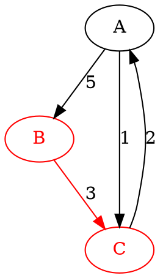

---
jupytext:
  formats: md:myst
  text_representation:
    extension: .md
    format_name: myst
kernelspec:
  display_name: Python 3
  language: python
  name: python3
---

# Ressources

::::{grid}

:::{grid-item-card} [Graphes)(#graphe)

```{image} img/PRO_graphe_exemple_02.png
:alt: Graphe
:align: center
:width: 120px
```

:::

:::{grid-item-card} [Diagramme de classes](#diagramme-de-classes)

```{mermaid}
classDiagram
    class NomClasse{
        attributs
        méthodes()
    }
```

:::

:::{grid-item-card} [Algorithme de Dijkstra](#dijkstra)

```{image} img/dijkstra_edsger.jpg
:alt: Graphe orienté
:align: center
:width: 120px
```

:::

:::{grid-item-card} [Format JSON](#json)

```{image} img/logo_json.png
:align: center
:width: 120px
```

:::

:::{grid-item-card} [Format HTML](#html)

```{image} img/HTML_logo.png
:alt: Multigraphe
:align: center
:width: 120px
```

:::

:::{grid-item-card} [Graphgviz](#graphviz)

```{image} img/graphviz_logo.png
:alt: Graphe pondéré
:align: center
:width: 120px
```

:::

::::

(graphe)=
## Graphes

### Définitions

Un **graphe** est un couple $G = (V, E)$ comprenant deux ensembles :
- $V$ un ensemble de sommets (*vertices* en anglais)
- $E$ un ensemble d'arêtes (*edges* en anglais), chacune étant une paire de sommets $\{u, v\}$ avec $u$, $v \in V$

Un **graphe orienté** est un graphe pour lequel les arêtes sont des couples $(u, v) \in V \times V$. Les arêtes d'un graphe orienté sont souvent appelées *arcs*. Les graphes orientés sont parfois appelés *digraph* par contraction de l'anglais *directed graph*

Un **graphe pondéré** (ou valué) est un graphe pour lequel un nombre positif est associé à chaque arête. Un graphe pondéré est un triplet $G = (V, E, w)$ où $V$ est l'ensemble de sommets, $E$ est l'ensemble des arêtes et $w : E \rightarrow \mathbb{R}_+$ est la fonction de pondération. $w(e)$ est appelé *poids* de l'arête $e \in E$.

Un **multigraphe** est un graphe où $E$ est un [multiensemble](https://fr.wikipedia.org/wiki/Multiensemble) (parfois appelé *sac*), c'est-à-dire une sorte d'ensemble dans lequel chaque élément peut apparaitre plusieurs fois. Un multigraphe autorise plusieurs arêtes entre deux sommets identiques.

Un **arbre** est un graphe sans circuit (suite d'arcs consécutifs dont les deux sommets extrémités sont identiques) et connexe (d'un seul tenant) dont la forme évoque la ramification des branches d'un arbre.

Exemple de représentation graphique des graphe :

::::{grid}

:::{grid-item-card} Graphe

```{image} img/PRO_graphe_exemple_01.png
:alt: Graphe
:align: center
:width: 120px
```
:::

:::{grid-item-card} Graphe orienté

```{image} img/PRO_graphe_exemple_02.png
:alt: Graphe orienté
:align: center
:width: 120px
```

Les arêtes sont des arcs orientés
:::

:::{grid-item-card} Graphe pondéré

```{image} img/PRO_graphe_exemple_03.png
:alt: Graphe pondéré
:align: center
:width: 120px
```

Un poids est associé au arêtes
:::

:::{grid-item-card} Multigraphe

```{image} img/PRO_graphe_exemple_04.png
:alt: Multigraphe
:align: center
:width: 120px
```

Plusieurs arêtes peuvent relier une paire de sommets
:::

:::{grid-item-card} Arbre

```{image} img/PRO_graphe_exemple_05.png
:alt: Graphe pondéré
:align: center
:width: 120px
```

Graphe connexe sans circuit
:::

::::

### Exemples d'utilisations
 
Un multigraphe orienté et pondéré est un outil de modélisation et d'analyse très répandu dans les sciences de l'ingénieur.
- ordonnancement de projet (diagramme de PERT)
- système de transport routier, ferroviaire, ou aérien
- système de distribution (eau potable, énergie électrique, hydraulique, pneumatique, géothermique ...)
- structure mécanique en treillis (ouvrage d'art, impression 3D, ...)
- système polyarticulé (cinématique ...)
- automate à états finis (automatisation des systèmes) 
- réseau électrique (lois de Kirchhoff)
- routage des circuits intégrés
- réseau de communication 

(diagramme-de-classes)=
## Diagramme de classes

Un [diagramme de classes](https://fr.wikipedia.org/wiki/Diagramme_de_classes) est un outil de modélisation utilisé en génie logiciel et en ingénierie système pour représenter la structure d'un système orienté objet. Il fait partie des langages de modélisation [UML](https://fr.wikipedia.org/wiki/UML_(informatique)) (Unified Modeling Language) du génie logiciel et du langage de modélisation [SysML](https://fr.wikipedia.org/wiki/Systems_Modeling_Language) (Systems Modeling Language) de l'ingénierie système. Il permet de visualiser les classes, leurs attributs, leurs méthodes, ainsi que les relations entre elles. Un diagramme de classe permet :
- la visualisation de la structure du système
- l'identification des relations pour comprendre comment les classes collaborent 
- la communication entre les membres d'une équipe de développement
- la planification du codage facilitant la répartition du codage entre les développeurs et les développeuses
- la documentation du projet

Le diagramme ci-dessous montre la représentation d'une classe nommée `NomClasse` avec la zone où les attributs sont listés et celle où les méthodes apparaissent.

```{mermaid}
classDiagram
    class NomClasse{
        attributs
        méthodes()
    }
```
<br />

Le diagramme ci-dessous présente une relation entre les classes `NomClasse1` et `NomClasse2`. Les annotations sur le lien permettent de décrire la relation.
- `relation`, placée au milieu de la ligne de relation, décrit la nature de la relation entre les classes
- `1` et `*`, placées aux extrémités des lignes de relation, sont des indications de multiplicité qui répondent à la question «&nbsp;combien d'instances d'une classe peuvent être associées à une instance d'une autre classe&nbsp;?&nbsp;».
  - ici `*` indique qu'une instance de la classe `NomClasse1` est en relation avec plusieurs instances de  le classe `NomClasse2`
  - ici `1` indique qu'une instance de la classe `NomClasse2` est en relation avec exactement une instances de la classe `NomClasse1`

```{mermaid}
classDiagram
    direction LR
    NomClasse1 "1" -- "*" NomClasse2: relation
```

(dijkstra)=
## Algorithme de Dijkstra

L'algorithme de Dijkstra résout le problème du plus court chemin dans un graphe. Plus précisément, il calcule les plus courts chemins à partir d'un sommet de départ vers tous les autres sommets dans un graphe orienté pondéré par des réels positifs. Le résultat d'algorithme est un arbre (graphe orienté particulier) dont la racine est le sommet de départ et dans lequel un chemin unique, le plus court, relie deux sommets. Chaque sommet est associé à la plus courte distance qui le sépare du sommet de départ.


<br />

Description de l'algorithme issue de la page ["Algorithme de Dijkstra"](https://fr.wikipedia.org/wiki/Algorithme_de_Dijkstra) de Wikipédia.

<div style="background-color:rgba(0, 0, 0, 0.0470588); padding:10px 0; font-family:monospace; font-size:0.8em;">
<strong>Entrées :</strong> <br>
    &nbsp;&nbsp;- <font color = "green">G</font> = (<font color = "green">S</font>, <font color = "green">A</font>) un graphe avec une pondération positive <font color = "blue">poids</font> des arcs<br>
    &nbsp;&nbsp;- <font color = "green">S<sub>deb</sub></font> un sommet de <font color = "green">S</font><br>

<strong>Sorties :</strong> <br>
    &nbsp;&nbsp;- <font color = "green">P</font> = (<font color = "green">S</font>, <font color = "green">Af</font>) un graphe (arbre de sommet Sdeb) <br>
    &nbsp;&nbsp;&nbsp;&nbsp;avec une pondération positive <font color = "blue">d</font> (distance) des sommets<br><br>

    
P := <font color = "orange" over>⌀</font><br>
    <font color = "blue">d</font>[<font color = "green">a</font>] := <font color = "orange" over>+∞</font> <strong>pour</strong> chaque sommet <font color = "green">a</font><br>
    <font color = "blue">d</font>[<font color = "green">s<sub>deb</sub></font>] := <font color = "orange" over>0</font><br>
    <strong>Tant qu</strong>'il existe un sommet hors de <font color = "green">P</font><br>
    &nbsp;&nbsp;&nbsp;&nbsp;Choisir un sommet <font color = "green">a</font> hors de <font color = "green">P</font> de plus petite distance <font color = "blue">d</font>[<font color = "green">a</font>]<br>
    &nbsp;&nbsp;&nbsp;&nbsp;Mettre <font color = "green">a</font> dans <font color = "green">P</font><br>
    &nbsp;&nbsp;&nbsp;&nbsp;<strong>Pour</strong> chaque sommet <font color = "green">b</font> hors de <font color = "green">P</font> voisin de <font color = "green">a</font><br>
&nbsp;&nbsp;&nbsp;&nbsp;&nbsp;&nbsp;&nbsp;&nbsp;Si <font color = "blue">d</font>[<font color = "green">b</font>] > <font color = "blue">d</font>[<font color = "green">a</font>] + <font color = "blue">poids</font>(<font color = "green">a</font>, <font color = "green">b</font>)<br>
&nbsp;&nbsp;&nbsp;&nbsp;&nbsp;&nbsp;&nbsp;&nbsp;&nbsp;&nbsp;&nbsp;&nbsp;<font color = "blue">d</font>[<font color = "green">b</font>] := <font color = "blue">d</font>[<font color = "green">a</font>] + <font color = "blue">poids</font>(<font color = "green">a</font>, <font color = "green">b</font>)<br>
&nbsp;&nbsp;&nbsp;&nbsp;&nbsp;&nbsp;&nbsp;&nbsp;&nbsp;&nbsp;&nbsp;&nbsp;<font color = "blue">prédécesseur</font>[<font color = "green">b</font>] := <font color = "green">a</font><br>
&nbsp;&nbsp;&nbsp;&nbsp;&nbsp;&nbsp;&nbsp;&nbsp;<strong>Fin Si</strong><br>
&nbsp;&nbsp;&nbsp;&nbsp;<strong>Fin Pour</strong><br>
<strong>Fin Tant que</strong>
</div>


(json)=
## JSON, format de fichier de données

### Contenu et format 

Le format JSON (JavaScript Object Notation) est un format de fichier et de transmission de données léger, facile à lire et à écrire pour les humains, et facile à analyser et à générer pour les machines. Bien qu'il soit dérivée de la syntaxe du langage JavaScript, ce format est indépendant du langage. JSON est largement utilisé pour échanger des données entre un serveur et une application web, ainsi que pour stocker des configurations et des données structurées.


Le format permet de représenter les données suivantes :
- des dictionnaires (nommés *object*) délimités par des accolades `{` `}`. Ce sont des collections non ordonnées de paires clé-valeur, où les clés sont des chaines de caractères et les valeurs peuvent être de n'importe quel type de données JSON.
- des listes (nommées *array*) délimitées par des crochets `[` `]`, elle sont ordonnées et chaque valeur peut être de n'importe quel type de données JSON.
- des nombres entiers ou flottants
- des chaines de caractères délimitées par deux guillements doubles `"` `"`.
- des littéraux booléens `true`, `false` et le littéral `null` qui représente la valeur nulle.

Exemple d'une données JSON

``` json
{
  "nom": "Dupont",
  "prenom": "Jean",
  "age": 30,
  "email": "jean.dupont@example.com",
  "adresse": {
    "rue": "123 Rue Principale",
    "ville": "Paris",
    "code_postal": "75001"
  },
  "telephone": ["0123456789", "0987654321"],
  "actif": true
}
```

La donnée principale de l'exemple est un dictionnaire dont les clés sont `"nom"`, `"prenom"`, `"age"`, `"email"`, `"adresse"`, `"telephone"` et `"catif"`. Les clés `"nom"`, `"age"` et `"catif"` sont associées à des données simples, respectivement une chaine, un entier et un booléen. les clés `"adresse"` et `"telephone"` sont associées à des données composées, respectivement un dictionnaire et une liste.

### Utilisation de JSON avec Python

Python propose un module dans sa bibliothèque standard pour travailler avec des données JSON, il s'agit du module `json`. Voici un exemple de conversion d'un dictionnaire Python en chaîne JSON où
- `import json` importe le module `json`
- `json.dumps()` convertit le dictionnaire Python assigné au nom `utilisateur` en une chaine JSON. L'argument `indent=4` est utilisé comme consigne de mise en forme de la chaine renvoyée.


```{code-cell} python
import json

# Dictionnaire Python
utilisateur = {
    "nom": "Dupont",
    "prenom": "Jean",
    "age": 30,
    "email": "jean.dupont@example.com",
    "adresse": {
        "rue": "123 Rue Principale",
        "ville": "Paris",
        "code_postal": "75001"
    },
    "telephone": ["0123456789", "0987654321"],
    "actif": True
}

# Conversion du dictionnaire en chaîne JSON
chaine_json = json.dumps(utilisateur, indent=4)
print(chaine_json)
``` 

En sens inverse, le code suivant convertie la chaine JSON assignée au nom `chaine_json` en un object Python
Explications

```{code-cell} python
# Conversion de la chaine JSON en dictionnaire Python
utilisateur_dict = json.loads(chaine_json)
print(utilisateur_dict)
``` 

(html)=
## HTML, langage des page web

### Le langage

HTML (HyperText Markup Language) est un langage de balisage de texte, c'est-à-dire un langage qui enrichit du texte pur avec des balises délimitant des séquences de caractères ou marquant une position à l'intérieur du texte afin de le structurer en paragraphes, en titres, en citations, en partie à mettre en exergue... Parmi les autres langages de balisage on retrouve par exemple $\LaTeX$ et SVG (Scalable Vector Graphics) pour les images. 

HTML décrit la structure d'une page Web, sous la forme d'une série d'__éléments__ balisés. Chaque élément indique au navigateur comment afficher son __contenu__ en l'informant de sa nature (entête, paragraphe, lien, liste, tableau...) et éventuellement de ses __attributs__.


Les structures types d'un élément HTML sont 

- `<nomBalise>Le contenu de l'élément</nomBalise>` pour les éléments avec contenu
- `<nomBalise>` pour les éléments sans contenu qui ne possède donc pas de balise fermante

Exemples de balises HTML :

- `<html>` élément racine de la page
- `<head>` élément contenant les métadonnées de la page
- `<title>` élément contenant la métadonnée "titre de la page"
- `<body>` élément contenant le corps de la page qui contient tout ce qui sera visible
- `<h1>` élément contenant un titre de niveau 1
- `<h2>` élément contenant un titre de niveau 2
- `<p>` élément contenant un paragraphe de texte
- `<a>` élément qui définit un hyperlien sur son contenu
- `<table>` élément contenant un tableau
- `` élément pour insérer une image dans une page (pas de contenu ni de balise de fin)

La syntaxe complète du langage de balisage `HTML` peut être obtenue sur le site [w3schools.com](https://www.w3schools.com/html/default.asp).

La figure suivante montre la constitution d'un élément _paragraphe_

<br />

Les attributs d'un élément vont se placer au sein de la balise ouvrante. Ils précisent ou apportent des informations complémentaires sur l'élément. La figure suivante montre un élément _hyperlien_ dont le contenu est le texte "eCampus" et dont l'attribut _href_ précise la destination de l'hyperlien vers https://ecampus.paris-saclay.fr/

<br />

La structure type d'une page est :

``` html    
<!DOCTYPE html>
<html>
    <head>
        <title>Titre de la page</title>
    </head>
    <body>
        Le contenu est ici...
    </body>
</html>
```

### Les tableaux en HTML

Les balises d'éléments HTML dédiées aux tableaux sont :

- `<table>` élément contenant un tableau
- `<tr>` élément contenant une ligne de tableau (tr pour "table row")
- `<td>` élément contenant une cellule de tableau (td pour "table data")
- `<th>` élément contenant une cellule d'entête de tableau (th pour "table heading")

Et la structure type d'un tableau dans le contenu d'une page html :
    
``` html    
<table>
  <tr>
    <th>header col 1</th>
    <th>header col 2</th>
  </tr>
  <tr>
    <td>raw col 1</td>
    <td>raw col 1</td>
  </tr>
</table>
```

Des exemples de mises en forme de tableaux sont disponibles sur le site [GeeksforGeeks](https://www.geeksforgeeks.org/html-tables/)


### Afficher une page HTML

La façon naturelle d'affichier une page décrite au format html est de la sauver dans un fichier nommé par exemple `fichier.html` et de l'ouvrir avec un navigateur web (Chrom, Firefox, Edge, Safari, ...), ce dernier assurement de visualisation.

Jupyter propose aussi des solution pour visualier le fichier directement dans un carnet avec le module `IPython.display`

L'affichage du rendu d'une page HTML peut se faire dans une cellule de code d'un carnet Jupyter.

Exemple d'un cellule Jupyter de code pour afficher d'une page depuis un fichier

```{code-block} python
# Affichage du rendu du fichier fichier.html dans un cadre de 250 x 75 pixels
import IPython.display
IPython.display.IFrame(src="fichier.html", width=250, height=75)
```

Exemple d'un cellule Jupyter de code pour afficher d'une page depuis une chaine de caractères Python

```{code-cell} python
# Affichage du rendu de la chaine page
import IPython.display

page = """<!DOCTYPE html>
<html>
    <head>
        <title>Titre de la page</title>
    </head>
    <body>
        Début du contenu de la page, qui contient un exemple de tableau
        <table>
          <tr>
            <th>header col 1</th>
            <th>header col 2</th>
          </tr>
          <tr>
            <td>raw col 1</td>
            <td>raw col 1</td>
          </tr>
        </table>
    </body>
</html>
"""

IPython.display.display(
    IPython.display.HTML(page)
)
```

(graphviz)=
## Graphviz, imageur de graphe

**Graphviz** (Graph Visualization Software) est un ensemble d'outils open source qui dessinent des graphes définis à l'aide de scripts suivant le langage DOT

- [Site web](https://www.graphviz.org/)
- [Grammaire formelle du langage DOT](http://www.graphviz.org/doc/info/lang.html)
- [Guide d'utilisation l'exécutable dot.exe](https://www.graphviz.org/pdf/dotguide.pdf)
- [Documentation du module graphviz](https://graphviz.readthedocs.io/en/stable/) de Python

<br />

### Utilisation de `dot.exe`

À partir d'un fichier texte `mongraphe.gv` qui décrit le graphe selon le format DOT, l'exécution `dot.exe` crée un rendu graphique. Pour un rendu au format PNG (option `-Tpng`) dans le fichier de sortie `mongraphe.png` (option `-o mongraphe.png`), la commande suivante est exécutée dans interface en ligne de commande du système d'exploitation 

```
> dot.exe -Tpng -o mongraphe.png mongraphe.gv
```

<br />

Pour exécuter cette commande directement depuis un script en langage Python, il est possible d'utiliser la fonction `os.system()` du module `os` de Python. Au préalable, il faudra avoir créé le fichier `mongraphe.gv` avec Python.

Exemple de fichier `mongraphe.gv`  


Rendu obtenu par l'exécution de `dot.exe -Tpng -o mongraphe.png mongraphe.gv`

<br />

### Utilisation du module `graphviz`

Le module `graphviz` de Python propose une classe `graphviz.Digraph` pour générer un rendu graphique des graphes orientés. Ses méthodes `edge()` et `node()` permettent d'ajouter des arcs et des sommets, tandis que sa méthode `render()` génère le fichier au format DOT et exécute dot.exe qui génère à son tour un fichier contenant l'image de  rendu du graphe.

<br />

Exemple de script Python avec le module Graphviz

```{code-cell}
import graphviz

g = graphviz.Digraph('mongraphe', filename='mongraphe.gv', format='svg')

g.edge('A', 'B', label='5')
g.edge('A', 'C', label='1')
g.edge('C', 'A', label='2')
g.edge('B', 'C', label='3', color='red')

g.node('B', color='red', fontcolor='red')
g.node('C', color='red', fontcolor='red')

g # affiche le rendu
```